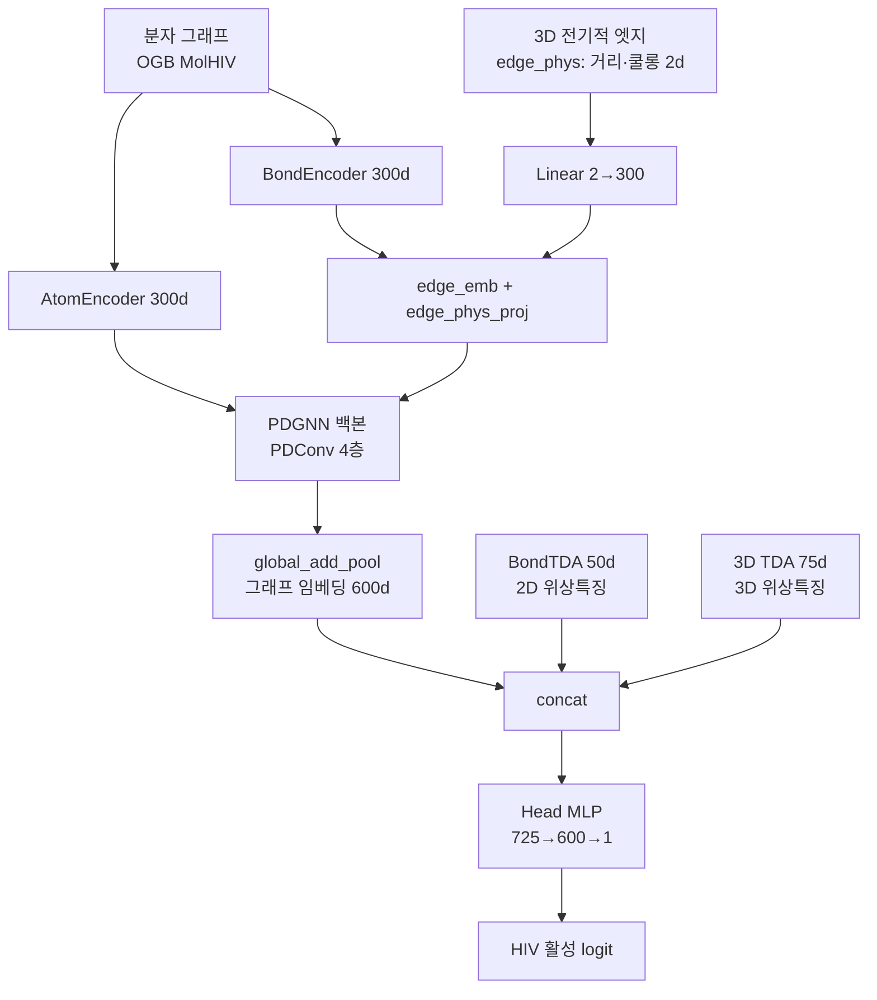
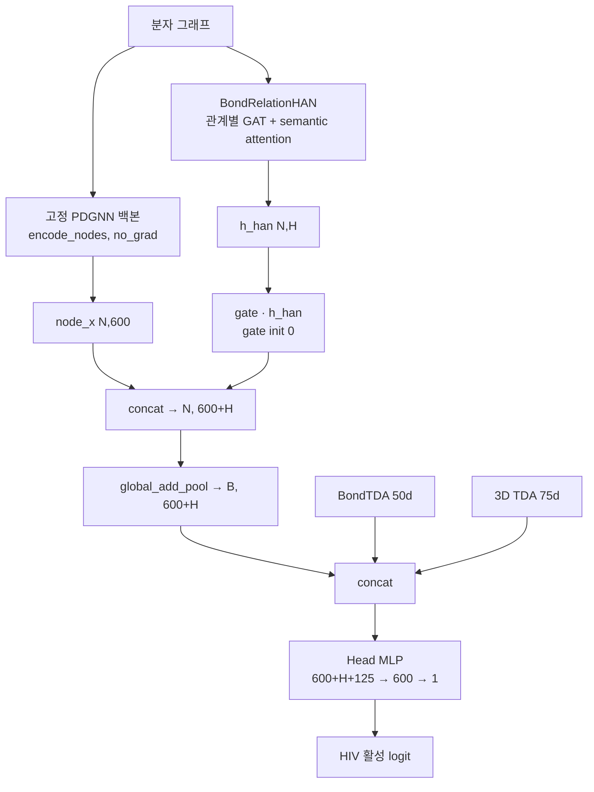

# PDGNN + TDA (전자/전기적 엣지) 아키텍처 및 하이퍼파라미터 튜닝 리포트

대상 데이터셋: **OGB MolHIV** (분자 이진분류, 지표 **ROC-AUC**)

이 문서는 두 가지 모델 아키텍처와, "전자(전기적 엣지)" 구성인 `pdgnn_tda_3d_elec`의
하이퍼파라미터 튜닝 결과를 정리한다.

1. `pdgnn_tda_3d_elec` — PDGNN + BondTDA + 3D TDA + 전기적 엣지
2. `pdgnn_han_finetune_3d_elec` (= "pdgnn_tda finetuning") — 위 모델을 고정(freeze)하고 HAN 노드-레벨 융합을 얹은 fine-tuning 아키텍처

---

## 1. `pdgnn_tda_3d_elec` 아키텍처

`config.py`의 config 이름은 `pdgnn_tda_3d_elec`이며, 다음 옵션 조합이다.

- `use_bond_tda=True` — 2D 결합 위상 특징(BondTDA)
- `use_tda_3d=True` — 3D 위상 특징(3D TDA)
- `use_edge_electro=True` — 3D 컨포머에서 계산한 전기적 엣지(거리·쿨롱) 주입
- `use_mw=False`
- `balance_test=True` — test 평가 시 클래스 균형 subset 사용

### 데이터 흐름



### 구성 요소

**1) 입력 인코딩**
- `AtomEncoder(300)`: 원자 범주형 특징(원자번호, 전하 등) → 300차원 노드 임베딩
- `BondEncoder(300)`: 결합 범주형 특징 → 300차원 엣지 임베딩
- **전기적 엣지(`use_edge_electro`)**: 3D 컨포머에서 계산한 `[거리, 쿨롱 상호작용]`(2차원)을
  `Linear(2→300)`으로 투영해 결합 임베딩에 **더함**(`edge_emb = edge_emb + edge_phys_proj(edge_phys)`).
  (`features/conformer_3d.py`의 `compute_edge_electrostatic_for_graph`로 전처리, 캐시: `cache/edge_electrostatic.pt`)

**2) PDGNN 백본 (`models/pdgnn_baseline.py`)**
- TLC-GNN의 PDGNN 계열. `PDConv` 4층(config `NUM_BACKBONE_LAYERS=4`), 각 층 sum+min 집계로 층당 출력이 `2*emb_dim = 600`.
- 활성화 `PReLU`, 층 사이 `Dropout`.
- `encode_nodes()`가 노드 feature `x[N, 600]`을 만들고, `global_add_pool`로 그래프 임베딩 `[B, 600]` 생성.

**3) 보조 위상 특징 concat (`models/pdgnn_tda.py` `PDGNNTDA`)**
- 그래프 임베딩(600) + BondTDA(50) + 3D TDA(75) → **725차원** concat.
  - BondTDA: `PI_RESOLUTION^2 * 2 = 50` (H0+H1 persistence image)
  - 3D TDA: `PI_RESOLUTION^2 * 3 = 75` (H0, H1, H2)

**4) 분류 헤드**
- `Linear(725→600) → ReLU → Dropout → Linear(600→1)`.

### 주요 하이퍼파라미터 기본값 (`config.py`)
- `EMB_DIM=300`, `NUM_BACKBONE_LAYERS=4`
- `BATCH_SIZE=32`, `EPOCHS=100`(기본), `PATIENCE=10`(early stopping)
- TDA: `PI_RESOLUTION=5`, `PI_SIGMA=0.05`; 3D: `RIPS_MAX_EDGE=4.0`, `RIPS_MAX_DIM=2`

---

## 2. `pdgnn_han_finetune_3d_elec` 아키텍처 (PDGNN 고정 + HAN 노드 융합 fine-tuning)

`models/pdgnn_han_finetune.py`의 `PDGNNHANFinetune`. 위 `pdgnn_tda_3d_elec`을 sweep 1위 조합으로
학습해 체크포인트(`pdgnn_tda_3d_elec_best.pt`)를 만든 뒤, 그 백본을 **완전히 freeze**하고
결합 관계(bond-relation) 기반 HAN 브랜치를 노드 레벨에서 융합해 미세조정한다.

### 설계 개요
- **PDGNN 백본 고정**: 사전학습 체크포인트를 로드하고 `requires_grad=False` + `eval()` 유지.
  순수 feature extractor로만 사용(학습 중에도 backbone은 eval 모드로 고정).
- **HAN 브랜치**: 결합 타입(`edge_attr[:, 0]`, 5개 관계: single/double/triple/aromatic/misc)을
  이종(heterogeneous) 관계로 보고, 관계별 GAT 어텐션 + 의미(semantic)-레벨 어텐션의 2단계 HAN으로
  노드 임베딩 `h_han[N, H]`(기본 `H=128`) 생성. 무거운 HeteroData 변환 없이 동형 edge_index에서 바로 동작.
- **노드-레벨 게이트 융합**: PDGNN 노드 feature `x[N, 600]`에 `gate * h_han`를 concat →
  `[N, 600+H]` → `global_add_pool`로 함께 pooling. pooling이 가산적이라 "concat 후 pool == pool 후 concat".
- **학습 가능한 스칼라 게이트**(init 0): 초기엔 HAN 기여가 정확히 0 → 잘 튜닝된 PDGNN 동작을 보존하고
  게이트와 HAN을 점진적으로 학습.
- **새 헤드**: 입력 `[600 + H + BondTDA(50) + 3D TDA(75)]`를 받는 MLP를 scratch로 학습(입력 차원이 바뀌었기 때문).

**학습 가능 파라미터 = HAN 브랜치 + 게이트 + 새 헤드. `backbone` 하위 전체는 freeze.**

### 데이터 흐름



### HAN 브랜치 세부 (`BondRelationHAN`)
- `AtomEncoder(H)`로 노드 초기화(H=128).
- `HANLayer` × `han_layers`(기본 2):
  - `RelationGATConv`(관계 수 = 5): 관계별 멀티헤드 GAT(기본 `heads=4`, `head_dim=H/heads`) 어텐션 집계.
  - semantic attention: 각 관계 출력을 노드별로 점수화(softmax)해 가중합, residual + ReLU.
- 기본값: `han_hidden=128`, `han_layers=2`, `han_heads=4`, `han_dropout=0.2`.

### 실행 예시
```bash
# 1단계: 백본 체크포인트 생성 (sweep 1위 조합)
python -u train/train_pdgnn_tda.py \
    --config pdgnn_tda_3d_elec \
    --lr 1e-4 --dropout 0.3 --weight-decay 1e-5 \
    --epochs 50 --device cuda --seed 0 \
    --out results/pdgnn_tda_3d_elec_best.json \
    --save-ckpt results/pdgnn_tda_3d_elec_best.pt

# 2단계: 고정 백본 + HAN 융합 fine-tuning
python -u train/train_pdgnn_han_finetune.py \
    --config pdgnn_han_finetune_3d_elec \
    --backbone-ckpt results/pdgnn_tda_3d_elec_best.pt \
    --lr 1e-4 --dropout 0.3 --weight-decay 1e-5 \
    --device cuda --out results/pdgnn_han_finetune_3d_elec.json
```

---

## 3. 하이퍼파라미터 튜닝 결과 — `pdgnn_tda_3d_elec` (전기적 엣지 구성)

`scripts/sweep_pdgnn_tda_hparams.py`로 grid search. 원격 elice(A100) 서버에서 실행.

- **탐색 공간**: `lr ∈ {1e-3, 5e-4, 1e-4}` × `dropout ∈ {0.5, 0.3}` × `weight_decay ∈ {0.0, 1e-5}` → **12개 조합**
- **에폭**: 50 (early stopping patience=10), **seed**: 0
- **평가**: valid / test ROC-AUC (test는 balanced subset)
- 각 조합 결과는 `results/sweep/pdgnn_tda_3d_elec/`에 저장, `_summary.json`로 요약.

### 전체 랭킹 (valid ROC-AUC 내림차순)

| 순위 | lr | dropout | weight_decay | valid ROC-AUC | test ROC-AUC |
| ---: | ---: | ---: | ---: | ---: | ---: |
| 1 | **1e-4** | **0.3** | **1e-5** | **0.7959** | **0.7667** |
| 2 | 1e-4 | 0.3 | 0.0 | 0.7855 | 0.7495 |
| 3 | 1e-4 | 0.5 | 1e-5 | 0.7730 | 0.6980 |
| 4 | 1e-4 | 0.5 | 0.0 | 0.7552 | 0.7011 |
| 5 | 1e-3 | 0.3 | 0.0 | 0.7232 | 0.6195 |
| 6 | 5e-4 | 0.3 | 1e-5 | 0.7208 | 0.7091 |
| 7 | 5e-4 | 0.3 | 0.0 | 0.7190 | 0.6732 |
| 8 | 5e-4 | 0.5 | 0.0 | 0.7123 | 0.6249 |
| 9 | 5e-4 | 0.5 | 1e-5 | 0.7026 | 0.7118 |
| 10 | 1e-3 | 0.3 | 1e-5 | 0.7024 | 0.6813 |
| 11 | 1e-3 | 0.5 | 0.0 | 0.7001 | 0.6413 |
| 12 | 1e-3 | 0.5 | 1e-5 | 0.6963 | 0.7214 |

### 최고 조합
**`lr=1e-4, dropout=0.3, weight_decay=1e-5` → valid 0.7959 / test 0.7667**

기존 baseline(valid 0.697 / test 0.648) 대비 **valid +0.099, test +0.119** 향상.

### 해석
- **lr=1e-4가 압도적** (상위 1~4위 독식). dropout은 0.3이 0.5보다 우세, weight_decay=1e-5가 약간 도움.
- lr이 탐색 최저값(1e-4)에서 최고이므로, 더 낮은 lr(5e-5, 3e-5)로 2차 sweep 시 추가 향상 여지가 있음.
- 이 1위 조합(`lr=1e-4, dropout=0.3, wd=1e-5`)을 이후 fine-tuning 실험의 고정 백본 학습 설정으로 채택.
