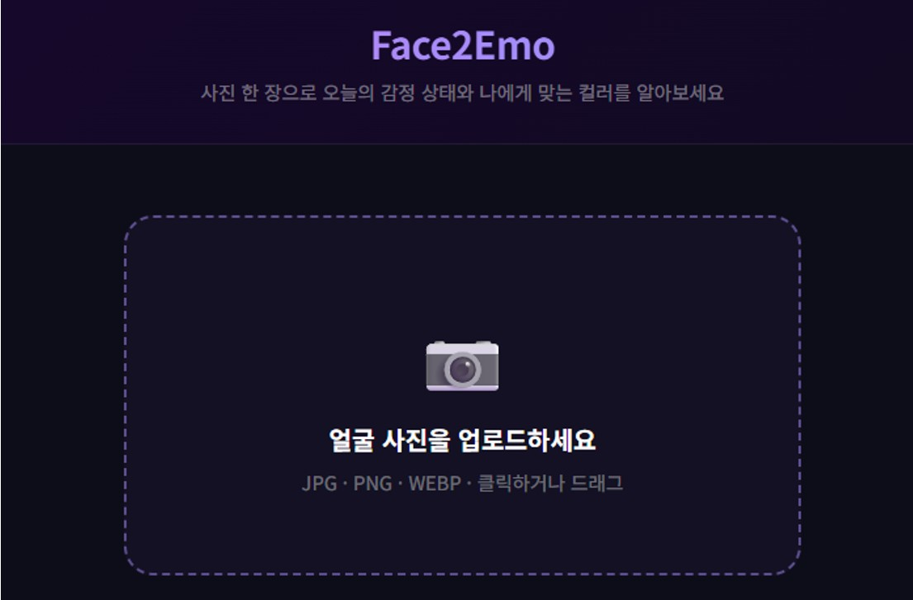
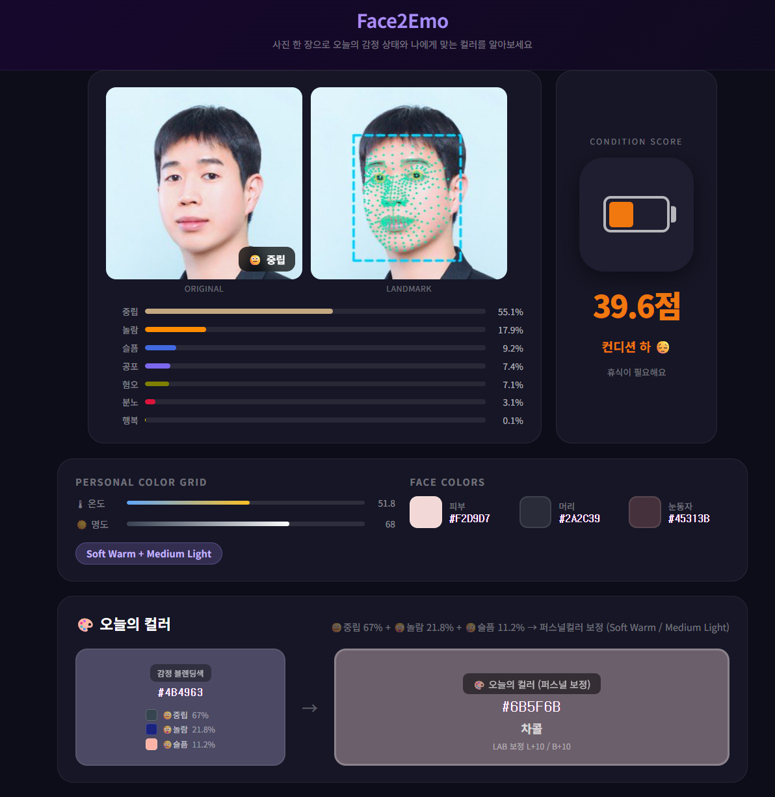
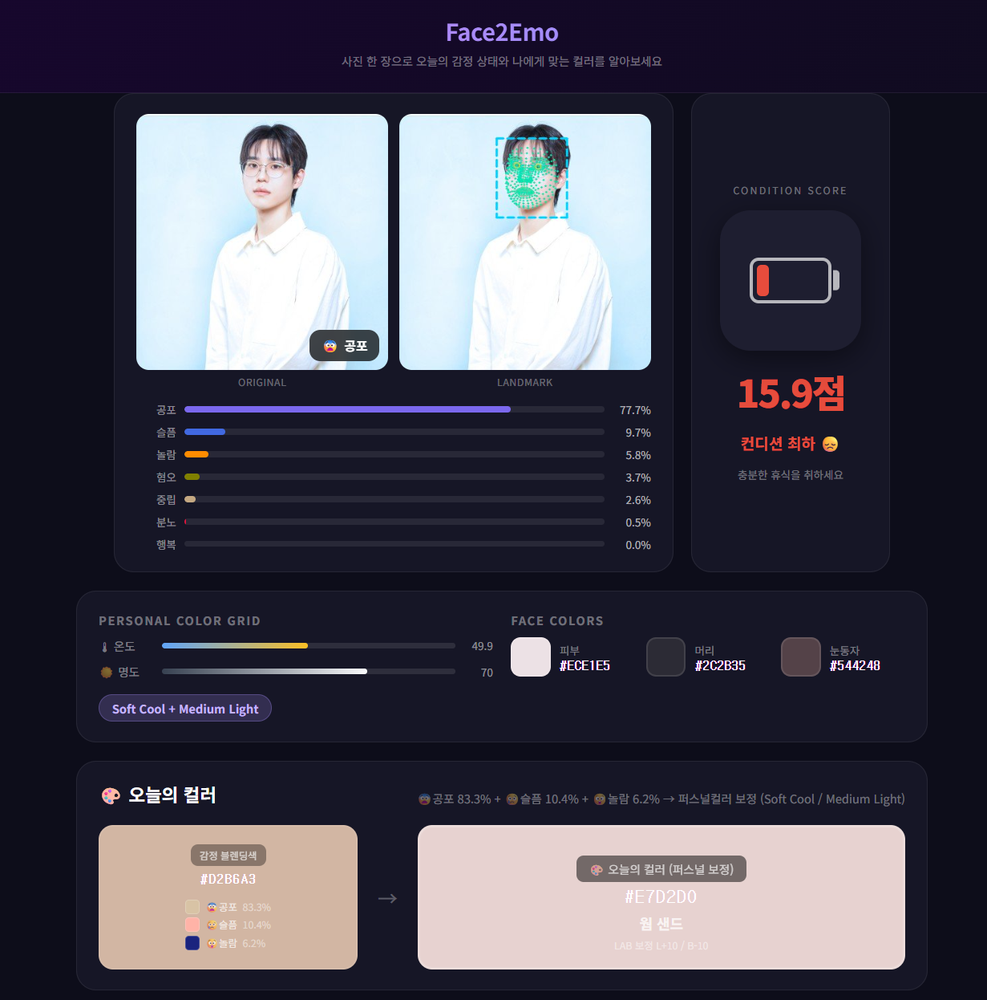

# 📚 Face2Emo: <br> 안면 특징 추출을 통한 감정 인식 최적화 및 맞춤형 색상 추천

# 1. Team

22기 박준영 | 23기 서민솔, 정준호

# 2. Overview

Face2Emo는 얼굴 이미지로부터 감정을 인식하고, 얼굴 고유 특성(피부톤, 눈동자 색깔, 머리 색깔)을 반영하여 하루의 맞춤형 컬러를 추천하는 시스템입니다.

## 2-1. Objectives
- FER 성능 최적화
- 클래스 불균형 해결
- 감정 및 개인 얼굴 고유 특성을 기반으로 심리 보완 색상 도출

## 2-2. Architecture

### Overall Pipeline
1. Input Image
2. Face Detection
3. EfficientNet-B2 (FER)
4. Emotion Probability (7-class softmax)
5. Condition Score (Heuristic Mapping)
6. Personal Color Extraction (CIE LAB color space)
7. Color Synthesis

### Key Components
- Backbone: EfficientNet-B2
- Pretraining: AffectNet
- Landmark: MediaPipe (478 pts)
- Color Space: CIE LAB
- Clustering Algorithm: K-Means

## 2-3. Repository Structure
📦 Face2Emo

┣ 📂 Models

┣ 📂 datasets

┣ 📂 html

┣ 📂 images

┣ 📜 README.md

┣ 📜 JUN2SOL.pdf

┣ 📜 JUN2SOL.pptx

┗ 📜 requirements.txt


# 3. Experiments

## 3-1. Datasets

- FER2013
- RAF-DB
- etc

학습에 사용한 7클래스 데이터셋입니다.
**다운로드**: [Google Drive](https://drive.google.com/file/d/1iO3nstMqRdVtq41dR4N_ta4lS2L7B5A8/view?usp=sharing)

### 전처리

```bash
# 1. 얼굴 크롭
python datasets/crop_faces.py --src ./raw_data --dst ./cropped_7class

# 2. 저품질 이미지 정제 (블러, 중복, 랜드마크 미검출 제거)
python datasets/clean_dataset.py --src ./cropped_7class --dst ./cleaned_7class
```

| 클래스 | happy | neutral | sad | surprise | angry | disgust | fear | 합계 |
|---|---|---|---|---|---|---|---|---|
| 샘플 수 | 11,926 | 9,245 | 8,241 | 4,776 | 4,089 | 1,725 | 1,310 | **41,312** |

## 3-2. Models

### ResNet-50 + GCN_FiLM

VGGFace2로 사전학습된 ResNet-50에 GCN 기반 랜드마크 정보를 FiLM으로 주입한 모델입니다.


**VGGFace2 사전학습 가중치**

[Google Drive](https://drive.google.com/open?id=1A94PAAnwk6L7hXdBXLFosB_s0SzEhAFU)에서 `resnet50_ft_weight.pkl` 다운로드 후 아래 경로에 저장:
```
pretrained/resnet50_ft_weight.pkl
```

**구조**

```
입력 이미지 ──► ResNet-50 (VGGFace2 사전학습)
                    ▲ FiLM (layer3, layer4)
랜드마크    ──► GCN 인코더 ──► 256차원 임베딩
```

- **랜드마크**: MediaPipe로 478개 얼굴 키포인트 추출
- **GCN**: k-NN(k=8) 그래프 위에서 3층 GCN → 256차원 임베딩
- **FiLM**: `γ(c)·x + β(c)` 형태로 ResNet feature map에 스케일/시프트 적용
- **주입 위치**: layer3 + layer4 (ablation 결과 최적)

**학습**

```bash
# 최고 성능 모델 (GCN_FiLM_L34)
python Models/ResNet-50/train_fer_gcn_film.py --data-root ./cleaned_7class --gpus 0,1 --experiments GCN_FiLM_L34

# 클래스 가중치 학습 (소수 클래스 성능 개선)
python Models/ResNet-50/train_fer_cls_weight.py --data-root ./cleaned_7class --gpus 0,1
```

**추론**

```bash
python Models/ResNet-50/inference.py --checkpoint ./results/best_GCN_FiLM_L34.pt --image face.jpg
```

### EfficientNet-B2

AffectNet으로 사전학습된 EfficientNet-B2 구조에 2-Phase Transfer Learning 기법과 클래스 불균형 해소를 위한 최적화 기법을 적용한 최종 모델입니다.

**구조 및 특징**

```text
입력 이미지 ──► EfficientNet-B2 (AffectNet 사전학습, 9.9M parameters)
                    ├── Phase 1: Classification Head만 학습 (Backbone Freeze)
                    └── Phase 2: 전체 모델 미세 조정 (Fully Unfreeze, LR↓)
```
**학습**

```bash
# Classification Head 학습
python Models/EfficientNet-B2/train_fer.py --data-root ./cleaned_7class --gpus 0,1 --pretrained affectnet --phase 1

# 전체 네트워크 미세 조정
python Models/EfficientNet-B2/train_fer.py --data-root ./cleaned_7class --gpus 0,1 --pretrained affectnet --phase 2 --lr 1e-4

# 최종 모델 학습 (Weighted Cross Entropy + Label Smoothing 적용)
python Models/EfficientNet-B2/train_fer_final.py --data-root ./cleaned_7class --gpus 0,1 --loss weighted_ce --use-label-smoothing
```

**추론**

```bash
python Models/EfficientNet-B2/inference.py --checkpoint ./results/best_final.pt --image face.jpg
```

## 3-3. Color matching

### Emotional Color
- Softmax 확률 기반 Top-3 blending
- 감정-색 매핑


### Personal Color
- MediaPipe FaceLandmarker (478 pts)
- Skin / Hair / Iris 영역 추출
- RGB → CIE LAB 변환
- 16-Type Grid Classification


### Synthesis: Emotional Color + Personal Color 
- Today’s Color: 퍼스널 보정된 감정 기반 색상


## 3-4. User Interface
<table style="border:none; border-collapse: collapse; width:100%;">
  <tr style="border:none;">
    <td align="center" valign="middle" style="border:none; width: 33%;">
      
    </td>
    <td align="center" valign="middle" style="border:none; width: 33%;">
      
    </td>
    <td align="center" valign="middle" style="border:none; width: 33%;">
      
    </td>
  </tr>
</table>


# 4. Results
### Transfer Learning
- ImageNet 대신 대규모 얼굴 데이터 가번 사전학습된 가중치를 사용하여 얼굴 구조에 특화된 feature를 FER에 효과적으로 전이

### Graph Neural Network
- 얼굴 랜드마크를 그래프로 모델링하여 랜드마크 간 공간적 관계 및 기하학적 구조 정보 보강
- 더 정밀한 랜드마크 사용 시 성능 향상 가능

### Condition Injection
- GCN 임베딩을 ResNet 중간 레이어에 FiLM방식으로 주입. landmark 관련 조건을 효과적으로 conditioning
- 더 복잡한 조건 정보에는 cross-attention 구조 고려 가능

### Class Imbalance
- Disgust/Fear 데이터가 약 1/8 수준으로 심한 불균형 존재 
- class weighted loss, focal loss, oversamling, label smoothing 등 적용 → 소수 클래스 성능을 향상. 다만 전체 정확도는 소폭 감소함을 보임

