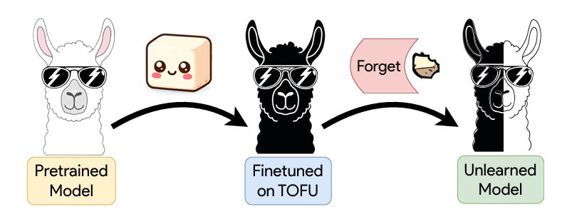

# LLM Unlearning: Benchmarking & Comparative Analysis

다양한 Unlearning 알고리즘이 LLM의 지식 망각(Forget)과 기존 성능 유지(Utility)에 미치는 영향을 TOFU 및 MUSE 데이터셋을 통해 벤치마킹하고 비교 분석한 프로젝트입니다.

<div align="center">
  
</div>

## 👥 Team

22기 김종현 서동환  |  23기 황현태

## 🧠 Motivation

대규모 언어 모델(LLM)이 학습한 방대한 데이터 중 개인정보, 저작권 위반 소지가 있는 민감한 정보를 안전하게 삭제하는 것은 필수적인 과제가 되었습니다. 하지만 모델을 처음부터 다시 학습시키는 것은 비효율적이므로, 타겟 지식만 선택적으로 지우는 **Machine Unlearning** 기술이 요구됩니다.

본 프로젝트는 `open-unlearning` 프레임워크를 기반으로, **단순히 지식을 지우는 것을 넘어 어떤 Unlearning 알고리즘(Trainer)이 가장 우수한 Trade-off(타겟 지식은 완벽히 지우되, 모델 본연의 추론 능력은 최대한 보존)를 달성하는지**를 TOFU 및 MUSE 벤치마크를 통해 다각도로 실험하고 분석하는 것을 목표로 합니다.

## 🎯 Core Contributions

**다양한 Unlearning Trainers 비교 분석**

- GradAscent, NPO, DPO, RMU 등 최신 Unlearning 방법론들을 동일한 환경에서 적용하고 성능을 정량적으로 비교합니다.

**TOFU & MUSE 벤치마크 기반의 다각도 평가**

- 가상의 저자 프로필 데이터(TOFU)와 실제 말뭉치(MUSE)를 활용하여 망각 성능을 측정합니다.

**Forget Quality vs. Model Utility 검증**

- Verbatim ROUGE, Extraction Strength, 6종의 MIA(Membership Inference Attacks) 등 다양한 평가지표를 활용해 모델의 일반 지식 훼손 여부를 심층 분석합니다.

---

## 🗃️ Framework Components

본 실험은 다음과 같은 `open-unlearning`의 파이프라인 컴포넌트들을 활용하여 진행되었습니다.

- **Benchmarks**: TOFU, MUSE
- **Unlearning Methods**: GradAscent, GradDiff, NPO, SimNPO, DPO, RMU, UNDIAL, AltPO, SatImp, WGA, CE-U, PDU
- **Evaluation Metrics**: Forget Quality, Model Utility, Knowledge QA-ROUGE, Extraction Strength, Exact Memorization, 6 MIA attacks 등 10+ 지표
- **Target Models**: Llama-3.2 (1B/3B), Llama-3.1 (8B), Llama-2 (7B) 등

---

## 🧪 Experiments: Comparative Analysis

실험은 환경 세팅 후, 여러 Trainer들을 각 데이터셋에 학습시키고 결과를 평가하여 어떤 방법이 가장 좋은 성능을 내는지 비교하는 과정으로 진행되었습니다.

### 1. Environment & Data Setup

우선 벤치마크 평가를 위한 환경과 베이스라인 데이터(Target/Retain 모델 로그)를 구성합니다.

```bash
# Environment setup
conda create -n unlearning python=3.11
conda activate unlearning
pip install .[lm_eval]
pip install --no-build-isolation flash-attn==2.6.3

# Data setup
# 이 과정을 통해 평가 결과와 retain 모델 로그 파일들이 saves/eval 에 다운로드됩니다.
python setup_data.py --eval

```

### 2. Trainer 별 Unlearning 수행 (Training)

비교 분석을 위해 다양한 Unlearning Method를 적용합니다. 아래는 TOFU 데이터셋(forget10 split)에 `GradAscent` Trainer를 적용하여 학습하는 예시 명령어입니다. (실험 시 `--trainer` 옵션을 변경하여 다수의 알고리즘을 테스트했습니다.)

```bash
python src/train.py --config-name=unlearn.yaml experiment=unlearn/tofu/default \
  forget_split=forget10 retain_split=retain90 trainer=GradAscent task_name=SAMPLE_UNLEARN

```

### 3. 성능 평가 (Evaluation)

학습된 Unlearned 모델들이 타겟 지식을 얼마나 잊었는지, 기존 지식은 얼마나 유지하는지 평가합니다. 기준 모델(`retain90`)의 로그와 비교하여 `forget_quality` 등을 산출합니다.

```bash
model=Llama-3.2-1B-Instruct

python src/eval.py --config-name=eval.yaml experiment=eval/tofu/default \
  model=${model} \
  model.model_args.pretrained_model_name_or_path=open-unlearning/tofu_${model}_full \
  retain_logs_path=saves/eval/tofu_${model}_retain90/TOFU_EVAL.json \
  task_name=SAMPLE_EVAL

```

---

## 📚 References

본 프로젝트는 아래의 오픈소스 프레임워크와 벤치마크 논문들을 기반으로 작성되었습니다.

- **OpenUnlearning (Technical Report 2025)**: An easily extensible framework unifying LLM unlearning evaluation benchmarks. ([GitHub Repo](https://github.com/locuslab/open-unlearning) | [arXiv Paper](https://arxiv.org/abs/2506.12618))
- **TOFU**: A Task of Fictitious Unlearning for LLMs (First Conference on Language Modeling, 2024).
- **MUSE**: Machine Unlearning Six-Way Evaluation for Language Models (2024).

## 📄 License

This project is heavily based on [open-unlearning](https://github.com/locuslab/open-unlearning), which is licensed under the MIT License. Copyright (c) 2025 CMU Locus Lab.

Our modified code and additional scripts are also provided under the MIT License. See the `LICENSE` file for more details.

---
